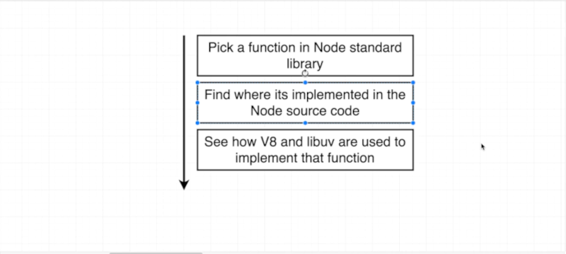

# Chapter-1 The internal of Node

## Table of Contents
1. [Starting With NodeJS](#starting-with-nodejs)
2. [Module Implementation](#module-implementation)
3. [Node Backed by C](#node-backed-by-c)
4. [The Basics of Threads](#the-basics-of-threads)
5. [The Node Event Loop](#the-node-event-loop)
7. [Is Node Single Threads](#is-node-single-threads)
8. [The `libuv` Thread pool](#the-`libuv`-thread-pool)
 
 

## Starting With NodeJS
 

### What is behind NodeJS ?

NodeJS internally has a collection of dependencies that is uses to execute the
code.

Behind NodeJS is `V8`-engine & `libuv`

### What is V8  ?

The `V8` project is an open source **JavaScript engine** created by Google that
written in C++ and JavaScript code. The purpose of `V8` is to be able to execute
JavaScript code outside of the browser.

### What is libuv ?

The `libuv` project here is a C++ open source project that gives NodeJS access
to the operating system underlying file system, it gives NodeJS users access to
**networking** and it also handles some aspects of **concurrency** as well.

`libuv` give access to developer to the file system, networking, etc..

### What is Concurrency in 'computer science' ?

In computer science concurrency is the **ability** of different parts or unit of
program, algorithm or problem to be executed out-of-order on in partial order,
without affecting the final outcome.

This allow for parallel execution of the concurrent (yang berbarengan) units,
which can significantly improve overall speed of the execution in
multi-processor and multi-core system.

In more technical terms, concurrency refers to the decomposability(menguraikan)
property of programs, algorithm, or problem into order-independent or
partially-ordered (secara sebagian-sebagian) components or units.

### What is purpose of NodeJS ? Why we not use directly  or libuv ?

NodeJS is actually written with half (50%) C++ and half more JavaScript. The
`V8`-engine project written 70% in C++ and 30% in JavaScript, and `libuv`
project written 100% in C++ code.

So chances are that as JavaScript developer do not want to be writing C++ code.

NodeJS give a nice interface (a point where two system) **to use**, **to
relate** (show a connection between) JavaScript side of application to the
actual C++ that running on computer, to actually interpret (make clear)
JavaScript and execute the code.

NodeJS provide a series (number of things) of wrappers (cover) and a very
unified (make or become united, uniform) inconsistent API for us to use inside
of our project. (MEANS: NodeJS enhance all inconsistent API into very
consistent).

**e.g**: NodeJS implements the `http`, `fs`, `path`, `crypto` modules.

**NOTE**: All the NodeJS modules have very consistent API.

NodeJS modules ultimately refer to a functionality that is mostly implemented
inside of the `libuv` project. So as JavaScript developer, the developer just
want to require in C++ functionality into JavaScript as a functions inside
codebase.

So by using of NodeJS you don't have to work with all the C++ that exists
iniside of `libuv` it self.

After long explanation,  __*the purpose of NodeJS*__ is to give developer a nice
consistent API for getting access to functionality that is ultimately
implemented inside a `V8` and `libuv`.

**[⬆ back to top](#table-of-contents)**
 
 

## Module Implementation

[`pbkdf2`](https://nodejs.org/dist/latest-v12.x/docs/api/crypto.html#crypto_crypto_pbkdf2_password_salt_iterations_keylen_digest_callback)
is the name of algorithm that is used for hashing some arbitrary data for
storage inside of database.

### How to understand what inside the 'lib' folder in 'nodejs/node/lib' ?

The `lib` folder in `github/nodejs/node/lib` is the JavaScript definitions of
functions and modules.

### How to understand what inside the 'src' folder in 'nodejs/node/src' ?

The `src` folder in `github/nodejs/node/src` is the C++ implementation of all
those functions in `lib` folder.

The `src` folder is where NodeJS actually pulls in `libuv` and `V8` project and
flushes out the implementation of all the models are used.

**[⬆ back to top](#table-of-contents)**
 
 

## Node Backed by C
 

### What is actually 'process.binding()' do ?

Since NodeJS `V11`
[process.binding()](https://nodejs.org/dist/latest-v12.x/docs/api/deprecations.html#deprecations_dep0111_process_binding)
**deprecated** and changes into `internalBinding()`.

`process.binding()` is what serves as an actual bridge between the JavaScript
side of NodeJS and C++ side. Which is where a lot of the **internal work** of
everything that NodeJS implemented.

Most of NodeJS code is relies upon ultimately C++ code.

The code `env->SetMethod(target, "pbkdf2", PBKDF2)` in
[`node/src/node_crypto.cc`](https://github.com/nodejs/node/blob/c7627da837af55e3a37ca0933b6a3247fc6c06bb/src/node_crypto.cc)
is essentially an export functions statement to implemented outside of C++
world.

So `internalBinding()` functions is a bridge between
`node/lib/internal/crypto.pbkdf2.js` into `node/src/node_crypto.cc`

### Why should I know this stuff ?

Is fundamental and sublime mandatory knowledge to know what behind the surface
of NodeJS doing. So as developer you know **why** , **what**, and **where** the
code coming from and works.

### What is purpose 'using v8::--' in 'node_crypto.cc' ?

Is essentially act as the intermediary (mediator) and allow values that are
defined inside of JavaScript to be translated into C++ equivalence.

So all the `using v8::..` are importing the C++ definition of JavaScript
concepts.  Like C++ understanding of what JavaScript `interger`, `array`,
`boolean` etc..  is. So this the `V8`-engine comes into play.

The `V8` project is used to translate the NodeJS values that place inside
different code like `boolean` or a `function` or an `object` and translate it
into their c++ equivalents.

### What is purpose 'uv_--' in 'node_crypto.cc' ?

`libuv` is used for a lot of concurrency and processing construct on the C++
side.

So after this explanation as the Developer have a better sense of **how**
whenever developer write a code and require in `node_modules` or `libraries`
they are depending upon some JavaScript definition which eventually kind of maps
up to actual C++ implementation

**[⬆ back to top](#table-of-contents)**
 
 

## The Basics of Threads

We going to dive into something called **event loop**. But before understand
event-loop as Developer should know **threads**.

### What is Process in 'computer science' ?

Whenever developer run a programs on computer, computer start up something called
a **process**

A process is an instance of a computer program that has been executed. Within
a **single process** you can have a **multiple threads**

A **single process** can have **multiple threads** inside of it.

One of the most interesting and important areas of study around **threads** is
understanding something called **scheduling**.

### What is Scheduling ?

Scheduling is the first operating systems ability to **decide** which thread to
process at any given instant in time

To notice, your computer has a limited amount of resources available in CPU, and
CPU can only process many instructions per second.

This structure get really relevant when we have many active process and threads
on your computer each **thread** have some urgent responsibility assigned to it.
Like __*Gets mouse to move around the screen*__ or __*Gets keyboard press to
appears*__

So **OS Scheduler** has to have look at all different **threads** that are
asking to be process and figure out how to do some amount of work on each of
**thread** while making sure do not have to wait too long to be processed.

**OS** job also ensure that **urgent threads** don't have to wait too long to be
executed.

There are a couple of different strategies that are used to **improve** the rate
at which these threads can be process. We focus on *two* strategies that going
to end up being very relevant in the NodeJS world.

1. **Add additional CPU core**

If computer have more then 1 core of CPU then we can easily process **multiple
threads** at the same time. Technically **one core** can process more than one
threaded at a time through process called **multi-threading** or
**hyper-threading**

2. **Examine the work that is being done**

This strategies is get really relevant in JavaScript world. In this example we
have two threads that are both competing for processing power.

NOTE: any time computer tries to **read data**, out of some type of medium like hard
drive, we refer that as **I/O**. **I/O** always takes some non zero amount of
time.

Your OS system scheduler has the ability to detect this downtime or this kind of
pause between instructions and it can be decide to put threads number one
(**Read file from HD**) on pause and then execute thread number two
(**Multiply**) a soon thread number two complete we can go back to threads
number one and continue waiting on the hard drive to be read.

### What is multi-threading or hyper-threading ?

A single CPU ability can process more than one threaded at single time.

### What is Event Loop ?

The event loop used by NodeJS to handle asynchronous code.

### What is Threads ?

Threads are units of instructions that are waiting to be executed by CPU.
Deciding which order to execute these threads is referred to as scheduling.

**[⬆ back to top](#table-of-contents)**
 
 

## The Node Event Loop
 

Whenever a NodeJS program start up in computer NodeJS automatically creates one
thread and execute all of code inside of that one single-thread. Inside
single-thread is something call the **event-loop**.

You can think of the event-loop as being like a **control structure** that
decide what **one thread** should be doing at any given point in time.

This event-loop is the absolute core of every NodeJS program that run; and every
program that run has exactly **one** event-loop.

Understanding how the event-loop works is extremely important because a lot of
**performance** concern about node boiled down to eventually how the event loop
behave (behaviors). So as developer if understand this event-loop then will be
very well equipped (complete) to understand performance issues in NodeJS as
well.

Understanding the event-loop is though. So we just write kind like pseudo code
that going to sort of emulate the event-loop, you can see
[event-loop.js](./../example/event_loop.js)

**[⬆ back to top](#table-of-contents)**
 
 

## Is node Single Threads
 

You may have read online from time to time that NodeJS is **single-threaded**,
that was people claim. People say NodeJS is single-threaded. The truth is much
more complicated.

The node **event-loop** that we just went through is truly **single-threaded**.
When start up a program with NodeJS a single-instance of the event-loop is
**created**; and **place** into one thread.

Now that's commonly seen as kind of a bad thing, because it means that our
program can only run on **one core** of CPU, so if we have many cores inside of
CPU then NodeJS **not** going to automatically take advantages (use) of those.
MEAN: your code (program) might not run as fast as it could be, because it's
**limited** to one single-thread.

However **Some of Node** functions that are included inside of the standard
library of NodeJS are not actually single-threaded. MEAN: some of the functions
that are include inside of NodeJS that run; run outside of event-loop; and run
outside of that single-thread.

So simply declaring that node is single-threaded is **not absolutely true**. The
event-loop uses a single-thread but a lot of the code developer write not
actually execute inside that thread entirely.

To prove NodeJS is node not absolutely single-thread just take a look in
[threads.js](./../example/threads.js)

Remember that a **thread** presents a **linear series of instructions** to CPU.
So the CPU has to follow all threads order that we present them in.

The result from **thread.js** for calling **pbkdf2()** of two takes exactly one
second. So with two functions calls, if this really was a single-threaded
system; I would have expected this entire process to take two seconds total.

Above diagrams clearly was not what occurred. We clearly saw that both these
logs occurred at basically the same time and it took just about equal to the
original run of threads function where we were only doing one single hash.

 

What really happen in NodeJS. NodeJS started up program at **zero second** and
then it took exactly **one second** for both those function calls to get to the
callback.

So clearly this is indicating that something is happening to indicate that
breaking out of a single-thread setup with NodeJS. Because if NodeJS only have
one single thread we would have seen the first function call it complete and
then the second call startup.

**[⬆ back to top](#table-of-contents)**
 
 

## The `libuv` Thread Pool
 

 

**pbkdf2()** has both the JavaScript implementation but it actually delegated
all the work done to the C++ side. So that's where the actual hashing process
took places

We also saw briefly in that
[`node/src/node_crypto.cc`](https://github.com/nodejs/node/blob/c7627da837af55e3a37ca0933b6a3247fc6c06bb/src/node_crypto.cc)
That seemed to be some references to a `libuv` library which as you recall gives
NodeJS some better access to the underlying OS.

The `libuv` module has another responsibility that is relevant for some very
particular functions in the standard library. So for *some* standard library
calls the NodeJS C++ side and `libuv` decide to do expensive calculations
outside of the event-loop entirely.

Instead `libuv` make use (create of) something called a [thread pool](#what-is-thrad-pool-?).
So that means that in addition to that thread used for the event loop there are
four other threads that can be used to offload expensive calculations that need
to occur inside of application.

Many other functions include in the NodeJS standard library will automatically
make use of this thread pool.

Remember the CPU runs all the instructions inside of a thread one by one. So
far thread had some line of instruction inside of it, that said run this code
that takes one second to run and we have to wait one second for that code to
run. So by using thread pool we don't have to wait one second and do other
things inside event-loop while calculations is occurring.

### What is thread pool ?

The thread pool **is** a series of four threads that can be used for running
computationally intensive tasks such as pbkdf2() function by default `libuv`
creates four threads in this thread pool.

## What is uses of thread pool ?

It's useful for doing computationally intensive tasks. because if event-loop was
responsible for doing expensive computational task only,  that means NodeJS
application **could do absolutely nothing else** while running other NodeJS
functions library

