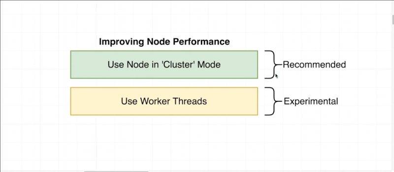
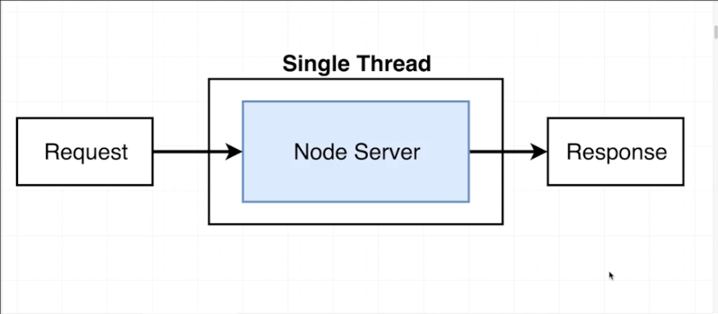
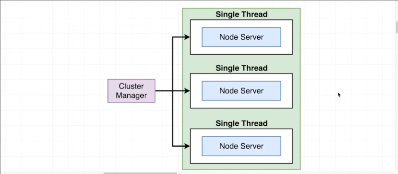
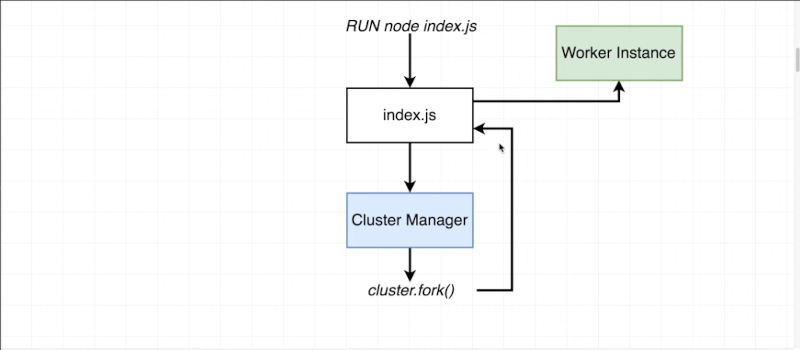
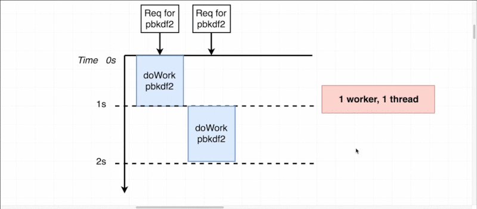
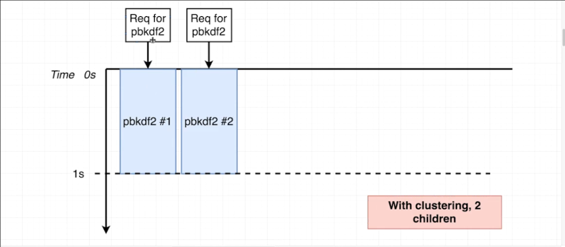
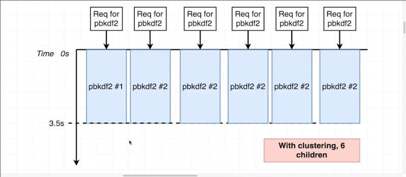
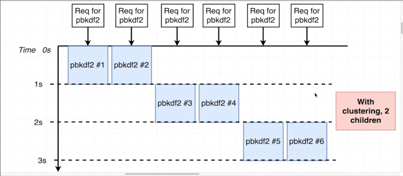

# Chapter-2 Enhancing Performance

## Table of Contents
1. [Enhancing Performance](#enhancing-performance)
2. [Blocking the Event Loop](#blocking-the-event-loop)
3. [Clustering in theory](#clustering-in-theory)
4. [Forking Children](#forking-children)
6. [Clustering in Action](#clustering-in-action)
7. [Benchmarking Server Performance](#benchmarking-server-performance)
8. [Need More Children | Benchmarking](#need-more-children-|-benchmarking)


# Enhancing Performance

We're going to look at how we can set up NodeJS to run inside **cluster** mode.
Is used to start up multiple copies of node that that are all running inside
them.



We cannot tricked node into running with multiple threads. But by starting up
multiple copies we get multiple instances of the event-loop. So it is vaguely
(uncertain) somewhat works in a similar fashion as **making node kind of
multi-threaded**.

The other thing going to investigate is using **worker threads** to do a lot of
performance work inside of applications. The worker threads are going to use the
threadpool is setup by `libuv` whenever start up node application.

**NOTE**: starting up NodeJS in **cluster mode** to handle a lot of *heavy duty
performance*,  *relevant calculations*, etc.. is **recommend approach** for
improving application performance. Cluster mode is very well battle tested
procedure  and it's something that are very confident will work correctly and
definitely enhance performance inside application.

**NOTE**: using **worker threads** is way more experimental and it's something
**not recommend approach**.


## What is cluster mode ?

Cluster mode is use to start up multiple copies of node that are all running
your server inside of them.

**[⬆ back to top](#table-of-contents)**
<br/>
<br/>

## Blocking the Event Loop

Example in [index.js](./../example/index.js)



So the first thing to keep in mind here is that whenever some request comes into
server it gets processed inside of **one Single Thread** that contains
**event-loop**.

So some **request** comes in, **server processes** and **generates a response**.

However we start to run into some big issues when these **incoming request**
takes **some amount time** to process; So if we have some request coming in that
requires a lot of processing power; like a lot of JavaScript that take a long
time to run through, then NodeJS server is not going to be able to process
incoming requests as effectively as they otherwise would.

Clearly the effect of some very long running or computationally intensive code
inside of a NodeJS project can be quite catastrophic.

So as developer though to understand why having NodeJS server run into a single
thread can sometimes be not very good approach.

**[⬆ back to top](#table-of-contents)**
<br/>
<br/>

## Clustering in theory
<br/>



When start to use clustering inside of NodeJS application, is going to be
starting up multiple node processes.

There's always going to be **one parent process** or one kind of like
overarching (comprehensive) process called the **cluster manager**.

The **cluster manager** itself doesn't actually execute any application code; So
in other words the cluster manager isn't really responsible for handling
incoming request or fetching data from database or doing anything like that.
Instead cluster manager is responsible for monitoring the **health of each
individual instances**.

Cluster manager can **start** instances, it can **stop** instances or
**restart** instances, can do other kind of like **administrative tasks** but
it's still going to be up to the these individual instances of our server to
actually process incoming requests and doing to access the database, or handle
authentication or serve up static files, or anything else might usually use in
NodeJS application for.

Understanding how all this clustering stuff works can be a little bit
challenging just by diagrams.


When use clustering the entire flow above changes little bit.



So when run `node index.js` we get one copy of node and cluster manager
automatically created. The cluster manager is then responsible for **starting
up** those **worker instance** were actually responsible for processing those
incoming request.

To **create** worker instances the cluster manager is going to **require in**
the **cluster module** from the NodeJS standard library.

So the cluster module is a standard library module just like `fs`, `htpp`,
`crypto` or any of those once.

There's one particular function on `cluster module` called `fork()` and whenever
we call that `fork()` something very interesting happens. NodeJS internally goes
back to `index.js` and execute it a second time, but it executes it that second
time in a slightly different mode, that starts up **worker instance**.

**MEAN**: `index.js` is going executed multiple times by NodeJS. The **first**
time it's going to produce **cluster manager**, **second** or every time after
that it's going to be producing **worker instances**.

## What is cluster manager

Cluster manager is responsible for monitoring the health of individual instances
of applications that we're going to launch at the same time on singular
computer.

**[⬆ back to top](#table-of-contents)**
<br/>
<br/>

## Forking Children

```javascript
// /example/.index.js
...
const cluster = require("cluster")

console.log (cluster.isMaster) \\ true
...
```

When NodeJS execute `index.js` NodeJS execute **content** that file; and NodeJS
starts up a copy of node that refer to as the **cluster manager**; The cluster
manager has `isManager` property always set to `true`; As soon start forking off
(`cluster.fork()`) additional worker instances `isMananger` set to `false`.

```javascript
// /example/.index.js
...
// Is the file being executed in master mode?
if (cluster.isMaster) {
    // Cause index.js to be executed *again* but in "slave | child mode"
    cluster.fork()
}
else {
    ...
}
```

**[⬆ back to top](#table-of-contents)**
<br/>
<br/>

## Clustering in Action

See [index.js](./../example/index.js)

When we start up one child that's not really doing a whole lot for us. We have
one child that's basically doing the same thing as just executing server in
normal mode.

Cause have only one child (`cluster.fork()`) we still only have one instance of
the event-loop and we're not really gaining any performance benefit.

**The practice**: if you have some **route** inside of your application that
usually take a **while (long)** to process, but you have **other route** that
are very quick; By using clustering you can start up multiple instances of your
server that more evenly address all the incoming request into your application
and have some more predictable response times.

It's sound clustering is the best choice in the NodeJS world, but there
definitely are some corner cases to be **aware of**.

**[⬆ back to top](#table-of-contents)**
<br/>
<br/>

## Benchmarking Server Performance

There's definite point diminishing (decrescent) return when you start using
clustering, in some cases can actually be kind of catastrophic for application.

So we need more scientific way of measuring long it takes for server to process
requests.

```javascript
// Benchmarking
$ ab -c 50 -n 500 localhost:800/fast

// result be like
Benchmarking localhost (be patient)
Completed 100 requests
Completed 200 requests
Completed 300 requests
Completed 400 requests
Completed 500 requests
Finished 500 requests


Server Software:
Server Hostname:        localhost
Server Port:            8000

Document Path:          /fast
Document Length:        13 bytes

Concurrency Level:      50
Time taken for tests:   0.583 seconds
Complete requests:      500
Failed requests:        0
Total transferred:      106000 bytes
HTML transferred:       6500 bytes
Requests per second:    857.39 [#/sec] (mean)    // XXX Important result XXX
Time per request:       58.317 [ms] (mean)       // XXX Important result XXX
Time per request:       1.166 [ms] (mean, across all concurrent requests)
Transfer rate:          177.51 [Kbytes/sec] received

Connection Times (ms)
              min  mean[+/-sd] median   max
Connect:        0    0   0.3      0       2
Processing:     5   55  10.6     56      72
Waiting:        0   55  10.7     56      72
Total:          6   55  10.4     56      72

Percentage of the requests served within a certain time (ms)
  50%     56
  66%     59
  75%     62
  80%     63
  90%     67
  95%     68
  98%     71
  99%     71
 100%     72 (longest request)
```

### What is benchmarking

Benchmarking is the act of measuring performance an comparing the result to
another system's results or widely accepted standard through a unified
procedure.

**[⬆ back to top](#table-of-contents)**
<br/>
<br/>

## Need More Children | Benchmarking

The case when use cluster to send a request into server with a larger amount of
request is server performance start to drop off cause take more amount of time
for each request.

### 1 worker, 1 thread



Above an example with [index.js](./../example/index.js).

We have two request coming into server to run `pbkdf2()`, now the instant that
the **first request** comes in (remember they're being issued at the same time)
but essentially one of those request is going to reach server before other. That
very first request immediately gets picked up by the threadpool and server start
to process it.

As soon as `pbkdf2()` is complete server response at about **1 second** mark and
that explains the minimum response time:

```bash
$ ab -c 2 -n 2 localhost:8000/

...
...

Connection Times (ms)
              min  mean[+/-sd] median   max
Connect:        0    0   0.1      0       0
Processing:  1093 1061 747.7   2150    2150     // XXX time XXX
Waiting:     1092 1621 747.8   2150    2150
Total:       1093 1622 747.6   2150    2150

...
...
```

Now at the same exact same time, the **second request** took additional
1 second, and so it eventually sent back the result at 2 second, that explains
in percentage time:

```bash
$ ab -c 2 -n 2 localhost:8000/
...
...
Percentage of the requests served within a certain time (ms)
  50%   2150 // XXX 2 second XXX
  66%   2150
  75%   2150
  80%   2150
  90%   2150
  95%   2150
  98%   2150
  99%   2150
 100%   2150 (longest request)

```

So the **first call** took about 1 second, the **second call** took 2 second;
And **yes they occurred at exactly the same time**, but the server only has the
ability to process one process `pbk2()` or hashing function at a time because we
restricted hat threadpool size to exactly **one thread** (`cluster.fork()`).

### Clustering, 2 children

```javascript
// ./example/index.js
....
....
if (cluster.isMaster){
    cluster.fork()
    cluster.fork()  // Add cluster
}
else {
....
}
```
Run benchmarking

```javascript
$ ab -c 2 -n 2 localhost:8000/

....
....
Connection Times (ms)
              min  mean[+/-sd] median   max
Connect:        0    0   0.1      0       0
Processing:  1161 1166   6.9   1170    1170     // XXX time XXX
Waiting:     1159 1624   6.7   1169    1159
Total:       1161 1622   7.0   1171    1171

Percentage of the requests served within a certain time (ms)
  50%   1171 // XXX 1 second took per request XXX
  66%   1171
  75%   1171
  80%   1171
  90%   1171
  95%   1171
  98%   1171
  99%   1171
 100%   1171 (longest request)
```


Above diagram and code example explain the request into server with
**clustering**. The two request very clearly have been processed just about in
**parallel**.

The both request came in clearly **first child** inside of cluster picked up the
**first call** and started processing it; and then the **second child** inside
of cluster started processing the **second call**. They both completed at the
1 second mark, we send back the response and everyone was happy.

So by using clustering we very clearly like, no two ways about it by using
clustering, we have gotten a very distinct benefit here.

Using **worker threads** took **2 second** to do two requests. By using
**clustering** it took **1 second** to do two requests.

### More cluster, nor performance

The case is if we use more fork (`cluster.fork()`), whenever start up the
application we get more separate instances and the separate instances can all be
used to process incoming requests, and every one can be served a response back
even faster than before or at least that's what **developer** might think.

Case:
```javascript
// ./example/index.js
....
....
if (cluster.isMaster){
    cluster.fork()
    cluster.fork()  // Add cluster
    cluster.fork()  // Add more cluster
    cluster.fork()  // Add more cluster
    cluster.fork()  // Add more cluster
    cluster.fork()  // Add more cluster
}
else {
....
}
```

So we've hot **six `cluster.fork()`**, whenever NodeJS start up application
we're going to get **six** separate instances can all be used to process
incoming request and every requests can be served a response back even faster
than before; that's what we might think. That's not what's really going to
happen here.

```bash
$ ab -c 6 -d 6 localhost:800/
....
....
Connection Times (ms)
              min  mean[+/-sd] median   max
Connect:        0    0   0.1      0       0
Processing:  3456 3490  26.3   3508    3521     // XXX minimun time XXX
Waiting:     3454 3488  26.2   3505    3519
Total:       3457 3491  26.1   3509    3521     // XXX maximum time XXX

Percentage of the requests served within a certain time (ms)
  50%   3509 // XXX 1 second took per request XXX
  66%   3509
  75%   3510
  80%   3510
  90%   3521
  95%   3521
  98%   3521
  99%   3521
 100%   3521 (longest request)
```



Above code and diagram interpret: When we start to get six request in every
single one took all the way out to 3.5 seconds.

NOTE: every computer has some upper limit to the amount of bits data that it can
just crunch at any given point in time.

So when run code like so and we do six at the same time that means that in those
six separate threads that are running six separate children we are **bouncing**
between every hash functions (`pbkdf2()`) called at the exact same time; and CPU
is trying to do a little bit of work on all request at exact same time.

The result is that we do **not** get code executed six times **faster**. Is it
took significantly longer to eventually get a response back from server to some
everyone.

So although we were able to address all these incoming request at the same time,
the net result was that our all overall performance suffered because CPU was
trying to bounce around and process all these incoming request at exactly the
same amount of time. This is a very clear case where we have kind **over
allocated** instances inside of **cluster**.

Even though we can definitely start processing all these hashes request at the
exact same time, the result is that we've kind of created like big average
**bottleneck** of mediocrity (just ordinariness) where we can only do so much at
any given time and we've been trying to do too much, so it;'s slowed down the
overall result.

So clearly there is an upper bound to the number of children that we might want
to create inside of cluster whenever we have some computationally intensive work
to do inside of application.

### Resolve upper bound
<br/>


```javascript
// ./example/index.js
....
....
if (cluster.isMaster){
    cluster.fork()
    cluster.fork()  // Add cluster
}
else {
....
}
```

```bash
$ ab -c 6 -d 6 localhost:800/
....
....
Connection Times (ms)
              min  mean[+/-sd] median   max
Connect:        0    0    0.1      0       0
Processing:  1128 2277 1026.3   2256    3445     // XXX minimun time XXX
Waiting:     1126 2276 1026.2   2256    3445
Total:       1128 2277 1026.2   2256    3445     // XXX maximum time XXX

Percentage of the requests served within a certain time (ms)
  50%   2256        // XXX 1 second took per request XXX
  66%   2256
  75%   3432
  80%   3432
  90%   3445
  95%   3445
  98%   3445
  99%   3445
 100%   3445 (longest request)
```

We get the result back went all the way own to about 3.4 second for the
**longest** request; But if you really breakdown you'll notice that fastest
request are processed in just 1 second **(1128)**.



In above diagram we are using clustering and we just use **two children**
(`cluster,fork()`). With two children we know that we can only process at best
two hashes (`pbkdf2()`) at any given time.

Now we are still kind of subject to an overload here but let's just kind of look
at the diagram. The all six requests technically come in at exact the same time.
They all come into server at exactly time **0 second**. The bars here represent
when CPU was actually working on each hash.

So the instances of first two function  calls come in immediately get redirected
over to CPU; each hash is executed on one CPU and gets the absolute full
dedicated attention of that one CPU.

So the first tow take form time 0 to 1 second; and after that one second already
finished the first two hashes; then two running children inside of cluster
cleared those request out; and ready for next two, and so on.

Even though used fewer children, actually have ended up with arguably a far
better performance profile then we did previously. Not only finishing all of
request hashes more quickly, we get everything faster than **3.5 second** but
a bulk of those hashes are being finished significantly faster.

So by increasing the number of children that you have inside application
dramatically beyond the number of actual logical core on physical CPU core,
you're going to have negative effect on the performance of your system.

**Conclusion**: Cluster is great but you gotta use with not go overboard with.
In general you want to match your number of cluster children (`cluster.fork()`)
to either the number of physical cores computer you have. But some of the
documentation around clustering uses **logical core** instead.

Using logical core is OK because it does mean that you will handle concurrent
requests little bit better when they are low on CPU requirements; but when it
start to come down to really heavy processing requirement in general you kind of
want to match up your number CPU to number of cluster children used.

