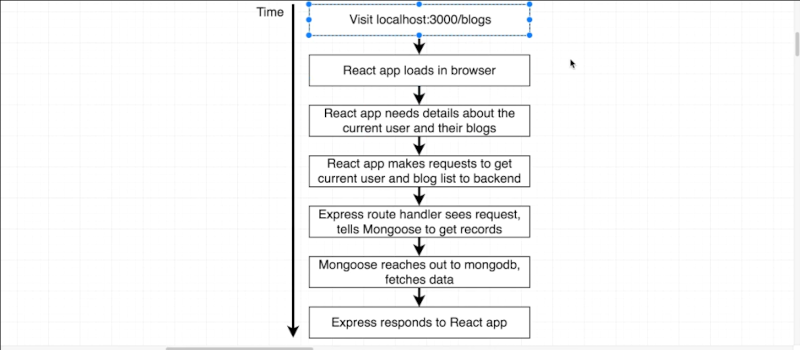
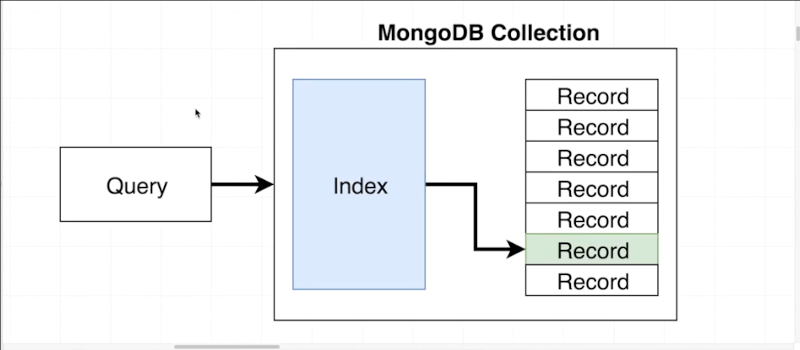
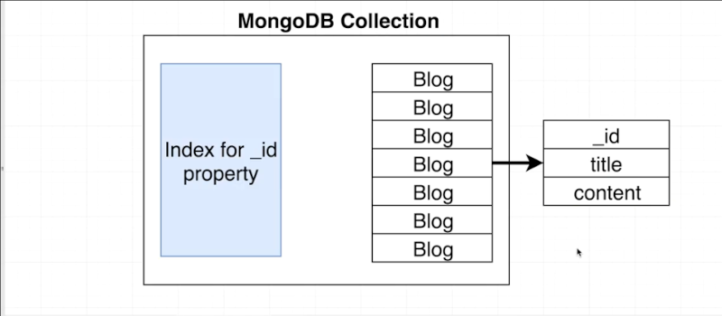
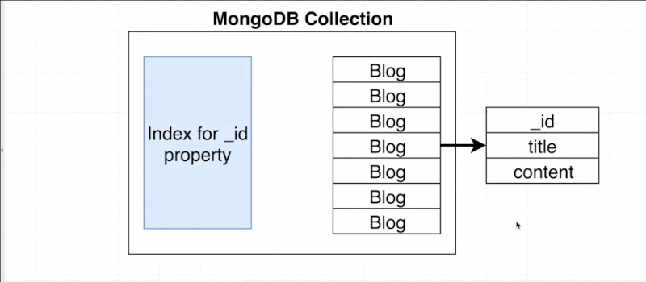

# Chapter-3 Data Caching with Redis

## Table of Contents
1. [The Next Phase](#the-next-phase)
2. [MongoDB Query Performance](#mongodb-query-performance)

## The Next Phase

**[⬆ back to top](#table-of-contents)**
 
 

## MongoDB Query Performance

Caching can be used with any type of database; but we specifiying on caching
with MongoDB.

Any time `mongoose` makes a query over to MongoDB database, MongoDB has
something internally called an **index**, an idex are matched with individual
collection.

So let's imagine what happens when that query to retrieve (get or bring back)
a list of blogs that belong to a given user come in.

**Query** arrive at MongoDB; The query is then sent to something called
**index**. Indices are efficient because they allow us to **not have look at
every single record** inside the collection to figure out which one we're trying
to find. Instead the index might allow to kind directly be line the record we
looking for. Indices like this are what make MongoDB **very quick**.

However there is something to be aware; whenever an index is created for
a MongoDB collection an index targets in individual property that exist. Every
single collection has an `_id` property of a record.

So because every record have specifically the `_id` property MongoDB can very
easily go and find the correct Blog post.

If we asked for a blog post with a specific title MongoDB would have to fall
back to its default behavior search as sequence or full collection scan and full
collection scan is extremely expensive operation.

So the takeaway here overall is that sometimes when we make a query over to
MongoDB; if we have an index ready that satisfies the query that queries will be
executed very quickly.

However the developer can very easily write queries that don't match up with an
index or don't have an index available. So in those situations we would very
easily run into big performance concerns around application.

Every additional index that we add to a collection it takes longer to write
records into that collections. In addition any time we add in more indices that
consumes more disk spaces and more memory as well.

Finally we might be making queries inside of an application where we can't
really figure out ahead of time what indices we need for it; and the query might
occur much more slowly than how we expect. We solve this issues using
**caching** inside of our application.

## What is index in MongoDB?
Is an efficient data structure for looking up sets of records inside that
collection.

### What is Caching

Is a hardware or software component that stores data so that future requests for
that data can be served faster; the data stored in a cache might be the result
of an earlier computation or a copy of data stored elsewhere.

